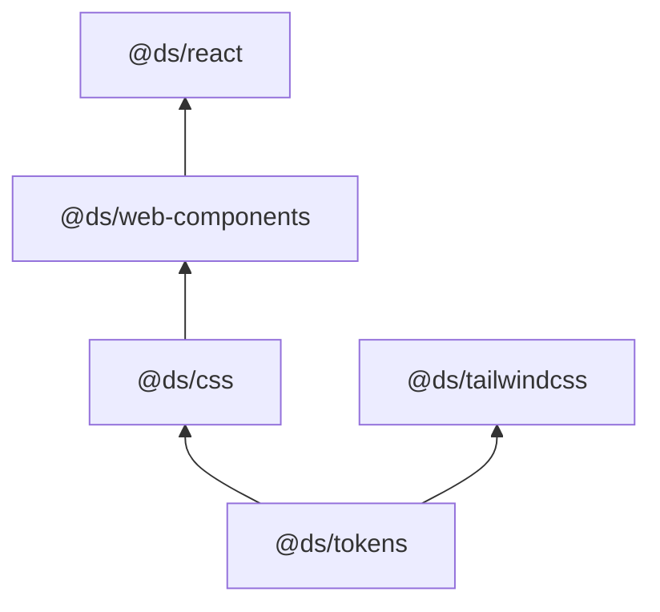

# Building Future-Proof Design Systems: A Practical Guide to Framework Independence

Example repository with the different packages presented in the talk, and sample apps.

```mermaid
flowchart BT
    tokens["@ds/tokens"]
    css["@ds/css"]
    wc["@ds/web-components"]
    react["@ds/react"]
    tailwind["@ds/tailwindcss"]

    tokens --> css
    tokens --> tailwind
    css --> wc
    wc --> react
```
